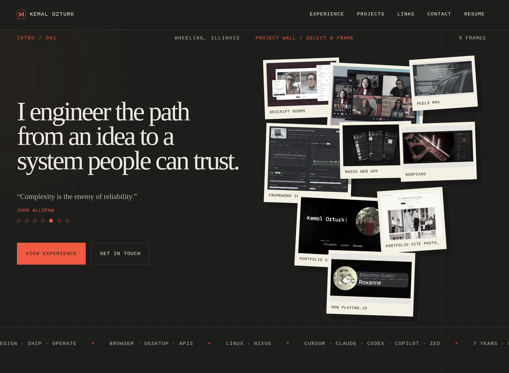

# Kemal Ozturk | Portfolio

A Svelte 5 single-page portfolio for Kemal Ozturk. Public GitHub repos are
snapshotted at build time; experience ships with product galleries; contact,
resume, and links sit on the same page. Custom CSS around an Ink & Signal
palette. Live at kozturk.com.

<p align="center">
  
</p>

## Features

- **Photo wall** — overlapping frames from experience shots and GitHub README
  images; a frame jumps to that card
- **Experience** — roles with highlights, tool chips, and product galleries
- **Projects** — public GitHub repos as cards (description, language, topics,
  README preview). Featured repos can add an eyebrow or live URL
- **Contact** — form to inbox, plus resume and profile links

## Stack

Svelte 5 · TypeScript · Vite · custom CSS · GitHub REST API · GitHub Actions ·
GitHub Pages · Web3Forms

## How it is put together

```
content.ts  ── copy, experience, toolkit, links ──▶  Svelte 5 SPA
GitHub API ── build-time snapshot ──▶  projects.generated.json
                                         │
                                         ├─ project cards
                                         └─ photo-wall frames
Web3Forms  ◀── contact form
GitHub Pages ◀── dist/  (CI on master)
```

Site copy lives in `src/lib/data/content.ts`. GitHub owns project
descriptions, topics, and README images.

## Getting started

Node 22+. Optional `.env` from `.env.example` (`VITE_WEB3FORMS_ACCESS_KEY` for
the contact form; `GITHUB_TOKEN` if you want a higher-rate project refresh).

```bash
npm install
npm run dev
```

`npm run check` validates Svelte and TypeScript. `npm run build` refreshes
GitHub projects, then writes `dist/`. `npm run projects` runs the snapshot
alone.

The snapshot fetches public repos (no archives or forks) and takes the first
useful README image. If GitHub is down, an existing non-empty snapshot is kept.

## Deployment

Pushes to `master` run `.github/workflows/deploy.yml`: refresh projects, check,
build, deploy `dist/` to GitHub Pages. Pages source must be **GitHub Actions**.
`public/CNAME` keeps the `kozturk.com` custom domain.
